```{r setup, include=FALSE}
knitr::opts_chunk$set(echo = TRUE)
library(png)
library(gridExtra)
```

## 1. Summary

In this analysis, we sought to develop a model that predicts a site's energy consumption by studying the effects of climate variables and building characteristics on the Site EUI (Energy Usage Intensity) to provide crucial information for potential optimized energy retrofitting. This helps in improving a building's asset performance (utilities). Retrofitting offers a potential upside in the overall performance of the building through improved energy efficiency, increased staff productivity, reduced maintenance costs, and better thermal comfort. By training an ensemble of prediction models like XGBoost, Gradient Boosting Machine, Light GBM, and Support Vector Machine with important variables selected using variable importance method based on Random Forest Regressor, `boruta` package, and Correlation Analysis, we aim to make accurate Site EUI predictions. We achieved a high prediction performance, with the lowest Root Mean Square Error (RMSE) of 18.501 along with a 50% Interval Score of 44.033, Average Interval Length of 17.292 and a coverage rate of 0.493 for the Light GBM method. Whereas we achieved a 80% Interval Score of 68.963, Average Interval Length of 40.015 and a coverage rate of 0.790.

## 2. Introduction

Climate change is an urgent, and multi-faceted issue heavily impacted by infrastructure. Addressing climate change involves mitigation of Greenhouse Gas (GHG) emissions via changes to electricity systems, transportation, buildings, industry, and land use. According to a report issued by the International Energy Agency, the life cycle of buildings from construction to demolition were responsible for 37% of global energy-related $CO_2$ emissions in 2020 (Abergel, 2021). Yet it is possible to drastically reduce the energy consumption of buildings. For example, retrofitted buildings can reduce heating and cooling energy requirements by 50-90%. Therefore, it is important to optimize energy retrofitting by accurately predicting Site EUI of these buildings. The study aims to investigate and understand the effect of climate variables and building characteristics on the building’s EUI (Energy Usage Intensity).					

The analysis aims to address the following questions:	

- Do the effects of building characteristics outweigh the effect of climate variables on Site EUI and vice-versa?

- Is there a need to build separate models for different Facility types or Building classes?

More specifically, the analysis has the following objectives to answer the questions above:

- To find important climate variable(s) and/or building characteristics variable(s) and determine the effects of said variable(s) on the site EUI

- To translate the relationship between the response and multiple covariates into insightful visualizations

- To model and predict the site EUI values

This report summarizes all of the primary statistical modelling and analysis results associated with the study. The remainder of the report is organized as follows: Section 3 describes the data collection, provides measurement of the variables and summarizes the data. Section 4 presents the data pre-processing and statistical modelling techniques used to answer the aforementioned research questions. Section 5 summarizes and interprets the results of the statistical analysis conducted. Appendices are provided for further exploratory data analysis along with the code used for the statistical modelling. Lastly, Section 6 presents the limitations and challenges in conducting this analysis and Section 7 and 8 cover the conclusion of this study and the next steps for future analysis, respectively.

## 3. Data

### 3.1. Description

The data was collected in collaboration with Climate Change AI (CCAI) and Lawrence Berkeley National Laboratory (Berkeley Lab) as part of the Women in Data Science Datathon (WiDS, 2022). Data contains roughly 100,000 observations of building energy usage records collected over 7 years, from a number of states within the United States. The dataset consists of building characteristics (e.g. floor area, facility type, etc), and weather data for the building location (e.g. annual average temperature, annual total precipitation, etc), as well as the energy usage for the building (Site EUI). Each row in the data corresponds to the a single building observed in a given year. The building class is residential (57%), with the others classified as commercial. There are 75757 rows and 64 columns with 3845 extreme values and 64448 rows containing at least one column with missing value.

\begin{center}
\textbf{Table 1}: Description of Building Characteristics Variables Used for Analysis
\end{center}

|  | **Variable** |**Unit** | **Description** |
|-|-----|---|-------------|
| 1. | ***(Response)*** Site EUI | $kBtu$ $ft^{-2}$ | The amount of heat and electricity consumed by a building as reflected in utility bills |
| 2. | Energy Star Rating  | - | Measure with a score between 1-100 where a higher energy rating means that the building performs better |
| 3. | Floor Area | $ft^2$ | Floor area of the building |
| 4. | Year Built | - | Anonymized year in which the weather and energy usage factors were observed |
| 5. | Elevation | $ft$ | Elevation of the building location |
| 6. | Facility Type | - | Building usage type |
| 7. | Building Class | - | Building classification (residential/commercial) |
| 8. | State Factor  | - | Anonymized state in which the building is located |
| 9. | Year Factor  | - | Anonymized year in which the weather and energy usage factors were observed |

\begin{center}
\textbf{Table 2}: Description of Climate Variables Used for Analysis
\end{center}

|  | **Variable** |**Unit** | **Description** |
|-|-----|---|-------------|
| 1. | [month]'s Minimum Temperature| $°F$ | Minimum temperature in [month] at the building location where month from January to December **(12 variables)**|
| 2. | [month]'s Average Temperature | $°F$ | Average temperature in [month] at the building location where month from January to December **(12 variables)**|
| 3. | [month]'s Maximum Temperature| $°F$ | Maximum temperature in [month] at the building location where month from January to December **(12 variables)**|
| 4. | Cooling Days | - | The number of degrees where the daily average temperature exceeds 65 $°F$ |
| 5. | Heating Days | - | The number of degrees where the daily average temperature falls under 65 $°F$ |
| 6. | Precipitation | $inches$ | Annual precipitation at the building location |
| 7. | Snowfall | $inches$ | Annual snowfall at the building location  |
| 8. | Average Temperature | $°F$ | Average temperature over a year at the building location  |
| 9. | Days Below 30F | - | Total number of days below 30 $°F$ at the building location  |
| 10. | Days Above 80F | - | Total number of days above 80 $°F$ at the building location |
| 11. | Direction of Max Wind Speed | $°$ | Wind direction for maximum wind speed at the building location |
| 12. | Direction of Peak Wind Speed | $°$ | Wind direction for peak wind gust speed at the building location |
| 13. | Max Wind Speed | $ms^{-1}$ | Maximum wind speed at the building location |
| 14. | Days With Fog | - | Number of days with fog at the building location|

\begin{center}
\textbf{Table 3}: Summary Statistics of All Climate Variables
\end{center}

| **Var** | **site_eui** | **esr*** | **floor_area** | **year_built** | **ELEVATION** | **Year_Factor** |
|:-:|:-:|:-:|:-:|:-:|:-:|:-:|:-:|:-:|:-:|:-:|
| **Count** | 75757 | 49048 | 75757 | 73920 | 75757 | 75757 |
|**Std**	|58.26|	28.66	|246875.8	|37.05	|60.66|	1.47|
| **Min** | 1.00 | 0.00 | 943 | 0.00 | -6.40 | 1.00 |
| **25%** | 54.53	| 40.00| 	62379| 	1927.00|	11.90	|3.00|
| **50%** | 75.29	| 67.00| 	91367 |	1951.00	| 25.00|	5.00|
| **Mean** | 82.58|	61.05	|165984	|1952.31|	39.51	|4.37 |
| **75%** | 97.28	|85.00|	166000|	1977.00	|42.70|	6.00|
| **Max** | 997.87|	100.00|	6385382|	2015.00	|1924.50|	6.00|

**esr - `energy_star_rating`

*Due to the large number climate variables, summary statistics for those variables hasn't been provided in the report. Please refer to the code.*

### 3.2. Exploratory Data Analysis

In our Exploratory Data Analysis, we aimed to find how individual explanatory individuals relate and behave alongside the response variable, Site EUI, as well other explanatory variables. We aim to suggest potential transformations to the features to find behaviors that will improve performances of models.

\begin{center}
\textbf{Fig. 1}: Relationship between explanatory variables and response (Site EUI)
\end{center}

```{r echo=FALSE, out.width='40%',fig.show='hold', fig.align='center'}


```

*Due to high dimensionality, scatterplots for only the important variables selected (discussed in later sections) are displayed above*

### 3.3. Correlation Analysis

In a preliminary attempt of gathering information on covariate relationships with Site EUI, we chose to perform spearman correlation. We find that energy star rating has the largest negative correlation with Site EUI (-0.66), suggesting a relatively strong decreasing relationship with the response. We also note a weak negative relationship of Site EUI with months from January to March and a weak positive relationship with summer months such as May,June, July, etc.

The high correlation between months of the same seasons suggest implementation of additional features for the 4 seasons in the place of separate months for example. the relationships observed between climatic features indicate  potential interactions or new replacement covariates in place of these terms

```{r echo=FALSE, out.width='80%', fig.align='center'}

```


## 4. Methods

### 4.0 Pipeline

Below in Fig. 6, we have a Proof-of-Concept pipeline that addresses all of our research questions. A breakdown of each of the steps shown in the end-to-end workflow diagram is covered below. 

```{r echo=FALSE, out.width='80%', fig.align='center'}

```

\begin{center}
\textbf{Fig. 2}: End-to-End Pipeline
\end{center}


### 4.1 Data Pre-Processing

#### 4.1.1. Dealing with Imbalanced Categories

To deal with imbalanced categories in `facility_type`, we generated plots to study the relative frequency distribution. We saw the disparity in frequency of different facility types, where 'Multifamily (un-categorized)' facilities vastly outnumbered all other facility types so we kept the top 6 categories and binned the rest into a new value called 'Others'.

As observed in the EDA we saw imbalanced State Factors, particularly with state 6 with the highest relative frequency (~0.75), and other State Factors accounting for less than 10% (each) suggesting we drop the `state_factor` column altogether. Fo future research we can work with undersampling/oversampling/SMOTE technique and explore this feature further.

``` {r, echo=FALSE ,out.width="70%", out.height="100%",fig.cap="Binning to deal with Imbalanced categories",fig.show='hold', fig.align = 'center'}


```

#### 4.1.2. Dealing with Missing Values

As part of the data pre-processing pipeline, we start by dropping duplicate rows, and columns with a high % of missing values (over 50%). With the remaining missing values, we used the KNN imputation method. The idea in kNN methods is to identify 'k' samples in the dataset that are similar or close in the space. Then we use these 'k' samples to estimate the value of the missing data points. Each sample's missing values are imputed using the mean value of the k-neighbors found in the dataset.Furthermore, we dropped highly correlated features using pairwise correlation analysis as observed in the EDA. The white lines in the figure below represent missing values.

``` {r, echo=FALSE ,out.width="25%", out.height="25%",fig.cap="Before and After Median Imputation",fig.show='hold',fig.align='center'}

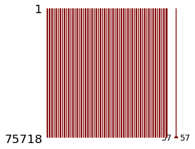
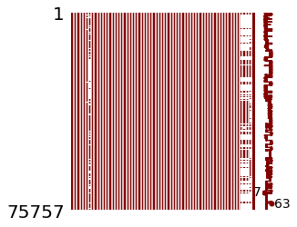
```

#### 4.1.3. Dealing with Extreme Values

``` {r, echo=FALSE ,out.width="25%", out.height="25%",fig.cap="After Extreme Value Removal with IQR Method",fig.show='hold',fig.align='center'}


```

We removed 3845 rows with extreme Site EUI values using the Inter Quartile Range (IQR) method. For the purpose of this project we assume the population with EUI values between 0 and 165. For future research, we plan on checking some variables to understand if the extreme cases should be considered as a different "population" or not.


#### 4.1.4. Encoding Categorical Variables

We encoded categorical features using ordinal encoding, where each unique category was assigned an integer value, resulting in a column of integers; 0 to `n_categories-1` (per features). We selected ordinal encoding over one-hot encoding because it creates multiple columns for each unique category and some of our categorical variables have high cardinality and will therefore increasing the dimensionality of an already high dimensional dataset. For future research we plan on exploring other encoding methods as well because ordinal encoding might impose an ordinal relationship where no such relationship may exist. 


### 4.2 Feature Selection

One of the most important step in our pipeline was Feature Selection as it is one of the main objectives. We have used several different methods in order to achieve this objective:

#### 4.2.1. Variable Importance using Random Forest & Correlation Analysis

This method is built on a random forest classifier. It ranks features based on their importance measure i.e. Mean Decrease Accuracy (MDA) where higher means more important. MDA measures how much accuracy the model losses by excluding each variable. The more the accuracy degrades, the more important the variable is. 

From the variable importance plot we see the 3 most importance variables by far are energy star rating, floor area and year built. We proposed the notion of  potential interactions with these terms later in feature engineering as these were all building characteristic features that could interact in describing the specific buildings. We also note particular importance of Facility Type, Elevation, as well as building class, relative to the other features in the dataset.

```{r, echo=FALSE ,out.width="49%", out.height="49%",fig.cap="Feature selection using Random Forest and Correlation Analysis",fig.align='center', fig.show='hold'}


```

\pagebreak


#### 4.2.2. Feature Engineering: Interactions and Additional features

Based on the variable importance and pairwise correlations we decided on adding interaction terms. We decided on including interactions of:

| **Feature Engineering** | **Feature Name** |
|---|---|
| `floor_area`*`year_built` | `floorxBuilt` |
| `floor_area`* `energy_star_rating` | `floorxEnergy` |
| `floor_area`$*$`ELEVATION` | `floorxELEVATION` |
| `floor_area`$*$`year_built`$*$ `energy_star_rating` | `floorxBuiltxEnergy` |
| `floor_area`$*$(`cooling_days` $+$ `heating_days`) | `floorxHeatCool` |
| (`march_avg_temp` $+$ `april_avg_temp` $+$ `may_avg_temp`$)/3$ | `SpringTemp` |
| (`june_avg_temp` $+$ `july_avg_temp` + `august_avg_temp`$)/3$ | `SummerTemp` |
| (`september_avg_temp` $+$ `october_avg_temp` $+$ `november_avg_temp`)/3 | `FallTemp` |
| (`december_avg_temp` $+$ `january_avg_temp` + `february_avg_temp`)/3 | `WinterTemp` |
| `days_below_0F` $+$ `days_below_10F` | `freezing_days` |
| `days_below_20F` $+$ `days_below_30F` | `cold_days` |
| `days_above_80F` $+$ `days_above_90F` | `warm_days` |
| `days_above_100F` $+$ `days_above_110F` | `hot_days` |
| `snowfall_inches` $+$ `precipitation_inches` | `snow_rain_inches` |

We also implemented new features containing other features that were otherwise correlated with one another, notably monthly temperature variables. Thus we decided to introduce seasonal terms, where `Spring` is the average of March, April, May temperatures, and so on.

In adding these features we dropped the original features contained within these, in turn this would help leave us with more parsimonious models to interpret.

#### 4.3 Feature Transformations

Table 4 shows all the transformations performed in order to achieve the desired results in reducing impacts of skewness of features.

\begin{center}
\textbf{Table 4}: Feature Transformations
\end{center}

| *Variable* | *Description* | *Transformation* | *Skewness* |
|-----|-------|-----|--|
| `floor_area` | Floor Area | (`floor_area`$)^{1/6}$ | Right|
| `year_built` | Year Built | log(2020 $-$ `year built`) | Left|
| `energy_star_Rating` | Energy Star Rating  | (`energy_star_Rating`$)^{2}$ | Left |
| `ELEVATION` | Building Elevation | (`ELEVATION`$)^{1/6}$ | Right |
| `floorxBuilt` | Interaction Term Floor Area and Year Built  | (`floorxBuilt`$)^{1/6}$ | Right|
| `floorxELEVATION` | Interaction term of building floor area and elevation | (`floorxELEVATION`$)^{1/8}$ | Right|
| `floorxEnergy` | Interaction Term Floor Area and Energy Star Rating  | (`floorxEnergy`$)^{1/6}$ | Right|
| `floorxBuiltxEnergy` | Interaction Term Floor Area and Year Built and Energy Star Rating | (`floorxBuiltxEnergy`$)^{1/6}$ |Non-Normal|
| `floorxHeatCool` | Interaction Term Floor Area and Sum of Heating and Cooling Degree Days  | (`floorxHeatCool`$)^{1/6}$ | Right |
| `freezing_days` | Total days below 0 and 10 F | (`freezing_days`$)^{1/5}$ | Slightly Right |
| `cold_days` | Total days below 20 and 30 F |  (`cold_days`$)^{1/2}$| Slightly Right |
| `warm_days` | Total days above 80 90 F |  (`warm_days`$)^{1/2}$ | Left |
| `hot_days` | Total days above 100 110 F | Dropped | contains mostly 0 |


### 4.4 Further Correlation Analysis

After the feature engineering and transformations, we investigated the correlations further to deal collinearity caused by the interaction terms. We see from the triangular correlation heat map below that there were still some highly correlated features. We dropped the following features:`floorxBuilt`, `floorxBuiltxEnergy`, `floorxHeatCool`, `floorxEnergy`, and `ELEVATION`.

``` {r, echo=FALSE ,out.width="50%", out.height="50%",fig.cap="Pairwise Correlation Analysis of Features",fig.show='hold',fig.align='center'}

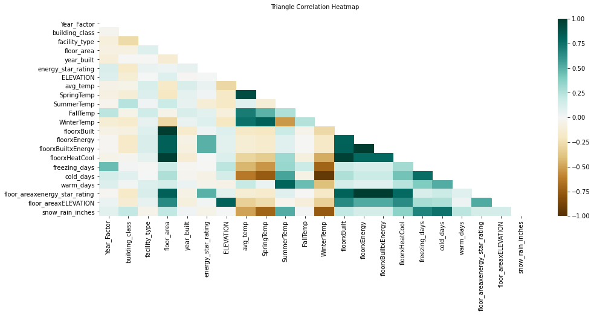
```

### 4.5 Further Refinements in Feature Selection using `boruta` package

We performed with further feature selection using the 'Boruta' package (Kursa, 2010) after feature engineering. The method uses a "relevant feature selection wrapper algorithm" to find the most "relevant" features using random forest, ranking on importance based on mean absolute deviation (MAD), allowing us to find and select the most important variables namely, `building_class`, `facility_type`, `floor_area`, `year_built`, `energy_star_rating`, `cold_days`, `warm_days`, `FallTemp`, `snow_rain_inches`, and `freezing_days`.

```{r, echo=FALSE ,out.width="45%", out.height="45%",fig.cap="Feature Selection After Feature Engineering using Boruta Package Output",fig.show='hold',fig.align='center'}
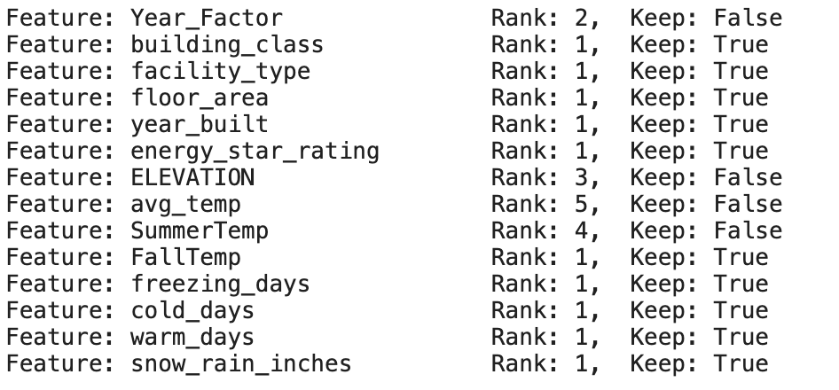
```


### 4.6 Principal Component Analysis

Principal Component Analysis (PCA) is a very useful method to deal with multi-collinearity based on Singular Value Decomposition (SVD), which reduces the dimensionality of the dataset as well (Kovan, 2021).Before conducting PCA we performed MinMax scaling because since PCA is solved via SVD, and SVD approximates in the sum of squares, so if one variable is on a different scale than another it will dominate the PCA. PCs describe variation and account for the varied influences of the original features.

There is more complex theory regarding the correlation matrix, eigenvalues and eigenvectors which forms the basis of PCA, however for the purpose of this analysis, a brief explanation felt appropriate.

```{r, echo=FALSE ,out.width="49%", out.height="49%",fig.cap="Principal Component Analysis",fig.show='hold', fig.align='center'}

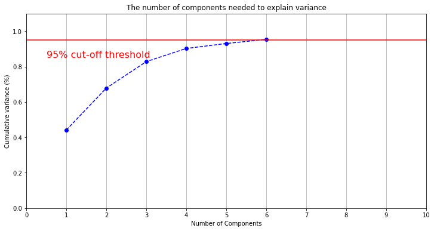
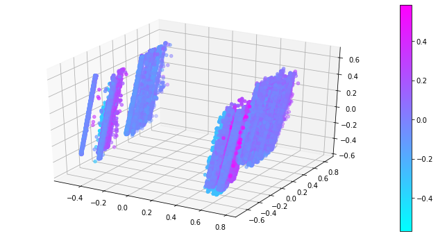

```


The figure on the right shows a 4D plot. This is not entirely representative of the Principal component space since we have 6 principal components. The plot shows clusters of samples based on their similarity. PCA does not discard any samples or characteristics (variables). Instead, it reduces the overwhelming number of dimensions by constructing PCs.

```{r, echo=FALSE ,out.width="40%", out.height="40%",fig.cap="Principal Component Analysis",fig.show='hold', fig.align='center'}


```

The first plot here shows that majority of the variance explained in our data is being captured by the principal component 1. And to each how each feature is playing a role in that, wee look at the plot on the right. The importance of each feature here is reflected by the magnitude of the corresponding values in the eigenvectors. The larger these absolute values are, the more a specific feature contributes to that principal component. 

### 4.7 Hyperparameter Tuning

For hyperparameter tuning, the reduced and transformed datasets were used. We used Random Search method with 10-fold repeated (3 times) cross validation where we defined a search space or parameter space as a bounded domain of hyperparameter values and the random search randomly sample points in that domain to give an optimized value that performs the best out of all combinations. For example for ElasticNet, we are tuning it based on 24000 combinations of parameters. We have the definition provided here for all the hyperparameters we used, if you need more information on this, you can check the sklearn documentation on each of these models or each out to me and i can direct you to the right resources.

```{r, echo=FALSE ,out.width="80%", out.height="80%",fig.cap="Hyperparameter Tuning",fig.show='hold', fig.align='center'}


```


## 4.8. Model Training and Validation

A good variety of models were implemented as a part of our analysis for extensive results. A set of models were trained to capture the effect of interaction terms on the predictive performance of the model. These models were cross-validated (10-fold CV, Repeated 3 times) and their hyperparameters were fine tuned using Random Search. Please refer to Table 5 and Table 6 for results that denote the predictive performance of the models. 


### 4.8.0. Linear Regression Model (Baseline Model)

We decided to begin with a baseline linear regression model for simpler interpretation and later model comparison.
The  model is of the form:  
$$y_{J} = \alpha_{J} + \sum_{i=1}^{14}\beta_{i,J} X_{i,J}+\beta_2 avgtemp_{J}+ \epsilon_{t,J}$$

Where X is the vector containing the 14 features along the auxiliary regression term (Sailor, 2001) for average temperature is in the form: 
$$avgtemp_{J} = \alpha_{J} + \beta_1 freezingdays{J} + \beta_2 (warmdays{J}*colddays_{t,J} +\beta_4 snowraininches_{J}+ \epsilon_{J}$$
We can interpret the most impactful covariates in terms of magnitude, obtained from the regression model summary.
We found that a one unit increase in floor area correlates to a $6.388^{1/6} kBtu ft^{-2}$ predicted increase in Site EUI, with all other variables held constant. Furthermore, a one unit increase in Year Factor 5 correlates to 9.826 $kBtu ft^{-2}$ predicted decrease in Site EUI, relative to  Year Factor 1 (baseline for Year Factor categorical variable) with all other variables held constant. Another significant covariate in the model was Average Temperature, a variable based on an auxiliary regression as aforementioned. We found that a one unit in the average temperature correlates to a 2.499 $kBtu ft^{-2}$ predicted decrease in Site EUI, with all other variables held constant.


#### 4.8.1. ElasticNet\
\
The Elastic Net (Karg, 2021) is a regularized regression method that linearly combines the penalties of the Lasso and Ridge regression methods. In Elastic Net regression the alpha term is a ratio of penalties $\lambda_1:\lambda_2$ where $\lambda_1$ is  alpha value of lasso and $\lambda_2$ is for ridge. When setting the ratio $=0$ it acts as a Ridge regression, and when the ratio $=1$ it acts as a Lasso regression. Any value between 0 and 1 is a combination of Ridge and Lasso regression Tables 5 and 6 show the results for this method.


#### 4.8.2. Support Vector Machines\
\
To add further complexities to the previous models, we trained Support Vector Machines (Gunn,1998) that expanded our feature space using different kernels. Radial kernel support vector machine is a good approach when the data is not linearly separable. We have a radial kernel to compare performance of models without the complexities relating to Linearity respectively. In the radial  kernel, only the neighboring behaviour of data is taken into account which means only those data points influence the modelling compared to the Linear SVM whose performance is similar to a Linear model. The idea behind generating non-linear decision boundaries is that we need to do some nonlinear transformations on the features $X_i$ which transforms them into a higher dimensional space.


#### 4.8.3. Tree Models\
\
We used three tree-based models, XGBoost (Chen, 2016), Gradient Boosting (Li, 2016) and Light Gradient Boosting (Guolin, 2017) to improve the performance of our model. Boosting slowly learns unique patterns in the data by sequentially combining individual, shallow trees. LightGBM (Guolin, 2017) is a much more optimized version of the gradient boosting algorithm. It produces much more complex trees by following leaf wise split approach rather than a level-wise approach which is the main factor in achieving higher accuracy. LightGBM uses a novel technique of Gradient-based One-Side Sampling (GOSS) to filter out the data instances for finding a split value while XGBoost uses pre-sorted algorithm & Histogram-based algorithm for computing the best split. From Table 5 and Table 6, we see that out of all tree-based models, LGBM performs the best, with the lowest RMSE of $18.501$ with relatively better 50% Interval Score, Average Length and Coverage of Prediction Intervals.


#### 4.8.4. Ensemble Models\
\
We trained an Ensemble model (Pajankar, 2022) with interaction terms which combines all the models above to produce improved results. Combining these models will generally tend to produce more accurate predictions than a single model. We used stacking which looks at the weighted RMSE of all the individual models to give a better prediction because it is designed to ensemble a diverse group of strong learners.


## 5. Model Results

### 5.0 Interpretation for Important Variables (ML Models)

\begin{center}
\textbf{Table 5}: Interpretation of Important Features in ML Methods 
\end{center}

| *Important Features* | *Correlation Strength against Site EUI* | *Correlation Direction against Site EUI* |
|:---:|:---:|:---:|
| building_class | Weak (0.15) | Positive |
| facility_type | Weak (-0.12) | Negative |
| floor_area | Weak (0.1) | Positive |
| year_built | Very Weak (0.024) | Negative |
| energy_star_rating | Moderately Strong (-0.65) | Negative |
| FallTemp | Very Weak (0.081) | Positive |
| freezing_days | Weak (0.18) | Positive |
| warm_days | Weak (0.1) | Positive |
| snow_rain_inches | Moderately Weak (0.28) | Positive |

### 5.1. In-Sample Model Metrics Comparison 
Based on the boxplot for R-squared values attained from the models we have mentioned, we see that the LGBM model has the highest, followed by XGboost and Ensemble, but the most noteworthy takeaway is that we see ElasticNet by far performs the worst possibly due to the linear nature of the method. As for the RMSE, we see that LGBM yet again performs the best with the lowest values, and once again followed by XGBoost. Unsurprisingly, ElasticNet performs the worst out of the models. 

Another metric we considered was how long it took for the models to run and produce output from the training data; "fit time". We see that the Stack ensemble takes generally 800 to 1000 minutes, while a slightly better performing model LGBM only takes a fraction of the time, and so based on practicality of the method in obtaining results, LGBM would be more preferable of all methods based on its relatively strong performance and faster run time.

```{r echo=FALSE, out.height='40%', out.width='40%',fig.show='hold',fig.align='center', fig.cap="Comparing In-sample Model Performance Metrics for Different Models",fig.show='hold', fig.align='center'}
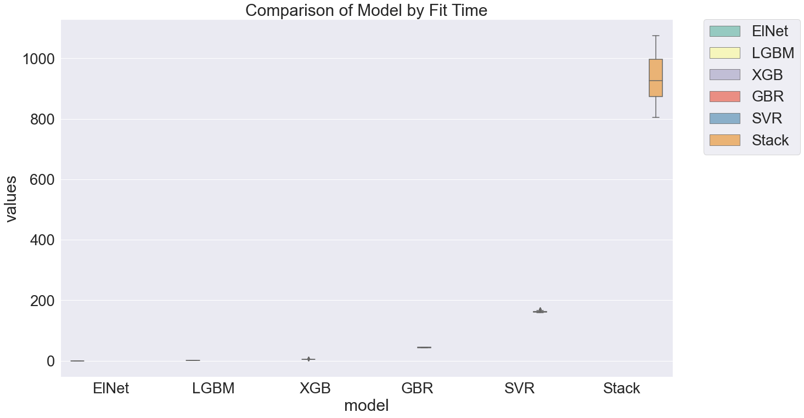
 
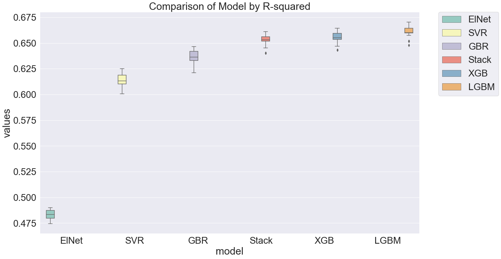 
```


### 5.2. Prediction Interval Comparison 


For the linear regression model we split the data into two subgroups based on building classes (43% commercial, 57% residential), and so we computed the prediction interval score, average length, and coverage rate for the two subgroups and then calculated the weighted sums (as shown in the code).
We noted in the output that model performed better in the residential split based on the interval score average length and coverage rate, relative to the commercial data.  
To generate prediction intervals for the other methods, we used the nonconformist python package which provides us a conformal prediction framework. We start by defining a nonconformity measure of our models using nonconformist's NcFactory module then we initialize a ICP (Invariant Causal Prediction) regressor and fit it to the sub training set which was obtained by further splitting our training set by 80%:20% ratio to sub training set and a calibration set. We fit the ICP Regressor on the sub training set and then calibrate the conformal predictor on the calibration set based on underlying nonconformity scorer. Then we just predict on the test set by specifying the significance. For example, a significance of 0.2 would give us the upper and lower bounds of 80% prediction intervals.

\begin{center}
\textbf{Table 6}: "50 $\%$ Prediction Intervals"
\end{center}


| Model | Level | Avg Length | Interval Score | Coverage |
|-------|-------|------------|----------------|----------|
| LR    | 0.5   | 33.982     | 62.839         | 0.579    |
| LGBM  | 0.5   | 17.292     | 44.033         | 0.493    |
| SVR   | 0.5   | 18.524     | 46.231         | 0.495    |
| GBR   | 0.5   | 18.859     | 45.450         | 0.489    |
| Elnet | 0.5   | 26.719     | 56.047         | 0.499    |
| XGB   | 0.5   | 17.461     | 44.206         | 0.491    |
| Stack | 0.5   | 18.197     | 44.446         | 0.497    |


\begin{center}
\textbf{Table 7}: "80 $\%$ Prediction Intervals"
\end{center}

| Model | Level | Avg Length | Interval Score | Coverage |
|-------|-------|------------|----------------|----------|
| LR    | 0.8   | 64.027     | 92.396         | 0.820    |
| LGBM  | 0.8   | 40.015     | 68.963         | 0.790    |
| SVR   | 0.8   | 42.463     | 72.444         | 0.799    |
| GBR   | 0.8   | 41.873     | 70.157         | 0.800    |
| Elnet | 0.8   | 55.012     | 82.333         | 0.806    |
| XGB   | 0.8   | 39.901     | 69.034         | 0.788    |
| Stack | 0.8   | 40.691     | 69.124         | 0.794    |

Based on the 50% Prediction Intervals provided, we believe that the best model relative to others is LGBM, as it has the lowest Interval Score and Average Length, while having a coverage of just over ~0.5 and ~0.8 for 50% and 80% prediction intervals respectively.
However, it is difficult to pick a best model as the performance of most of the models is almost comparable and hence it is inconclusive to pick one best model. We notice the worst performing model is the Linear Regression model followed by the ElasticNet due to the highest Interval score and the Average Length.

If we were to look at RMSE and fit time in addition to prediction intervals, we can say LGBM is relatively the better performing model. Thus based on the in-sample metrics we examined and the prediction intervals, we would prefer LGBM out of all the methods. Although this is subjective to an extent, it is safe to say ElasticNet and linear regression, which are linear methods, performed the worst, indicating the usefulness of tree-based methods for this data.

The tree based, ElasticNet, and stack ensemble methods provide better prediction intervals however there is a tradeoff as the linear regression model is more intepretable.


## 6. Limitations


- For data pre-processing, it was evident that there were quite a few extreme values (over 3000 cases) for site EUI (larger than 160 $kBtu$ $ft^{-2}$) that went up to 1000 $kBtu$ $ft^{-2}$. While removing these datapoints was necessary, it requires justification. 

- We could have looked at more research papers exploring relationships between climate variables and building characteristics to engineer much more robust features.

- The main objective of the research paper is to be able to predict site EUI in order to find those buildings that should be retrofitted (high site EUI buildings). However, the data provided is from the US, which would make the findings of the report useful to only 1 country. Researching into site EUI data for other countries of different socioeconomic standing could allow us to have results that are applicable world over.

- Python doesn't provide any package to generate prediction intervals while performing cross validation. Since we had multiple complex machine learning models, creating a custom function to do 10 fold cross validation with 3 repeats on the tuned models and generate prediction intervals was simply not feasible due to time constraints and limited computational power.


## 7. Future Research


- Perhaps with more time and resources,we could have done more literature review to find out if there are instances where a building can have a site EUI of 1000 $kBtu$ $ft^{-2}$ (i.e. if these buildings were run by large corporations, which may explain the energy usage).

- Engineer more robust features and interactions by investigating the relationship between climate variables and building characteristics even further.

- Finding more information on the distribution of climate and building variables  and site EUI for other countries of different socioeconomic standing could allow us to have results that are applicable world wide.

- For future research we also plan on exploring other encoding methods as well because ordinal encoding might impose an ordinal relationship where no such relationship may exist. 


## 8. Conclusion

Following the model iterations and improvements, we were able to achieve good results in an impartial manner. The LGBM algorithm provides somewhat accurate predictions, and the results have large implications with regards to identifying buildings with a high site EUI, which may then be retrofitted.

To answer the first of our two questions, "Do the effects of building characteristics outweigh the effects of climate variables on Site EUI and vice-versa?", we engineered features based on both building characteristics and climate variables. Based on indicators that determine the influence of covariate on the site EUI (Spearman correlation, individual plots of covariates with the response, and pairwise correlation), it became evident that building characteristics far outweigh the effects of climate variables on site EUI.

Next, to address the other question, "Is there a need to build separate models for different facility types or building classes?", for the linear regression model, we split the data based on building class (residential and commercial). The results obtained suggest that separating by facility types or building classes does not make a huge difference. According to analysis on lienar regression model, residential facility types have positive correlation with site EUI, which is not the same for commercial data (some commercial buildings are positively related to site EUI, such as laboratories, while others are negatively related, such as worship places).

Overall, the analysis was able to find the important variables that have the biggest affect on site EUI. The report provided insightful visualizations that accompanied the complex models, and most importantly, the report provided appropriate Machine Learning models that predicted site EUI fairly well.


## 9. Contributions

- **Anjali** - EDA & Preprocessing, Feature Selection, Transformations, Hyperparameter Tuning, Model Validation and Results, Editing final document
- **Idris** - EDA & Preprocessing, Literature Reading, Tables and Plots, Report Section 2, 3, 6, 7, Editing final document, Citations
- **Sameer** - EDA & Preprocessing, Literature Reading, Report Section 1, 2, 4, 5, Editing final document
- **Sumit** - EDA & Preprocessing, Literature Reading, Linear Regression model, Editing final document


\pagebreak


## 10. References
- Abergel T., Chiara D. (November 01 2021) .Tracking Buildings 2021 - Analysis. International Energy Agency. Acquired from: https://www.iea.org/reports/tracking-buildings-2021

-  Chen, T and Guestrin, C. (2016). XGBoost: A Scalable Tree Boosting System. In Proceedings of the 22nd ACM SIGKDD International Conference on Knowledge Discovery and Data Mining (KDD '16). Association for Computing Machinery, New York, NY, USA, 785–794. DOI: https://doi.org/10.1145/2939672.2939785

- Gunn, S. R. (1998). Support vector machines for classification and regression. ISIS technical report, 14(1), 5-16. Acquired from: https://see.xidian.edu.cn/faculty/chzheng/bishe/indexfiles/new_folder/svm.pdf

- Guolin Ke, Qi Meng, Thomas Finley, Taifeng Wang, Wei Chen, Weidong Ma, Qiwei Ye, Tie-Yan Liu. (2017). “LightGBM: A Highly Efficient Gradient Boosting Decision Tree.” Advances in Neural Information Processing Systems 30 (NIPS 2017), pp. 3149-3157
https://see.xidian.edu.cn/faculty/chzheng/bishe/indexfiles/new_folder/svm.pdf

- Karg, K. (2021, May 2). ElasticNet regression fundamentals and modelling in Python. Medium. Retrieved April 8, 2022, from https://medium.com/mlearning-ai/elasticnet-regression-fundamentals-and-modeling-in-python-8668f3c2e39e

- Kursa, M. B., & Rudnicki, W. R. (2010). Feature Selection with the Boruta Package. Journal of Statistical Software, 36(11), 1–13. https://doi.org/10.18637/jss.v036.i11

- Li, Cheng (2016). A Gentle Introduction to Gradient Boosting. College of Computer and Information Science Northeastern University. URL: http://www.ccs.neu.edu/home/vip/teach/MLcourse/4_boosting/slides/gradient_boosting.pdf.

- Pajankar, A., Joshi, A. (2022). Ensemble Learning Methods. In: Hands-on Machine Learning with Python. Apress, Berkeley, CA. https://doi.org/10.1007/978-1-4842-7921-2_10 

- Park, Junghoon, & Lim, Changwon. (2021). Predicting movie audience with stacked generalization by combining machine learning algorithms. Communications for Statistical Applications and Methods, 28(3), 217-232. https://doi.org/10.29220/CSAM.2021.28.3.217

- Pedregosa F., Varoquaux, G., Gramfort, A et al. (2011) Scikit-learn: Machine learning in python. Journal of Machine Learning Research Volume 12, (JMLR 12 2011):2825–2830. Acquired from:
https://www.jmlr.org/papers/volume12/pedregosa11a/pedregosa11a.pdf?ref=https://githubhelp.com

- Sailor, D. J. (2001). Relating residential and commercial sector electricity loads to climate—evaluating state level sensitivities and vulnerabilities. Energy, 26(7), 645-657. Acquired from: https://www.sciencedirect.com/science/article/pii/S0360544201000238

- Ugarte, M. J. (2021, March 11). Nonconformist: An easy way to estimate prediction intervals. Medium. Retrieved April 8, 2022, from https://medium.com/spikelab/nonconformist-an-easy-way-to-estimate-prediction-intervals-b0ded1eb066f

- WiDS (Women in Data Science)  Datathon 2022. WiDS Datathon Committee., Stanford University, Harvard University IACS . (February 26 2022) . Retrieved January 2022. From [https://www.kaggle.com/competitions/widsdatathon2022/data].


\pagebreak

## 11. Appendix


### 11.0. Libraries and packages used:

Python:

- os

- numpy as np 

- pandas as pd 

- matplotlib.pyplot as plt

- seaborn as sns

- sklearn import preprocessing

- sklearn.ensemble import RandomForestRegressor

- lightgbm import LGBMRegressor

- sklearn.ensemble import StackingRegressor

- sklearn.linear_model import LinearRegression

- xgboost import XGBRegressor

- sklearn.pipeline import Pipeline

- sklearn.model_selection import KFold

- sklearn.svm import SVR

- sklearn.model_selection import cross_val_score

- sklearn.ensemble import GradientBoostingRegressor

- sklearn import model_selection

- sklearn.metrics import mean_squared_error

- re

- sklearn.linear_model import ElasticNet

- pickle

- sklearn.preprocessing import MinMaxScaler

- warnings

- sklearn.preprocessing import OrdinalEncoder

- sklearn.impute import KNNImputer

- missingno as msno

- matplotlib.ticker import StrMethodFormatter

- boruta import BorutaPy

- sklearn.decomposition import PCA

- pickle

- mpl_toolkits.mplot3d import Axes3D

- bioinfokit.visuz import cluster

- sklearn.model_selection import RandomizedSearchCV, GridSearchCV

- nonconformist.cp import IcpRegressor 

- nonconformist.nc import NcFactory

R:

- dplyr

- caret

- png

- gridExtra

\pagebreak
 
 
### 11.1. Spearman Correlation with Response
``` {r, echo=FALSE,fig.cap="Spearman Correlation with Response",out.height="70%",fig.show='hold',fig.align='center'}

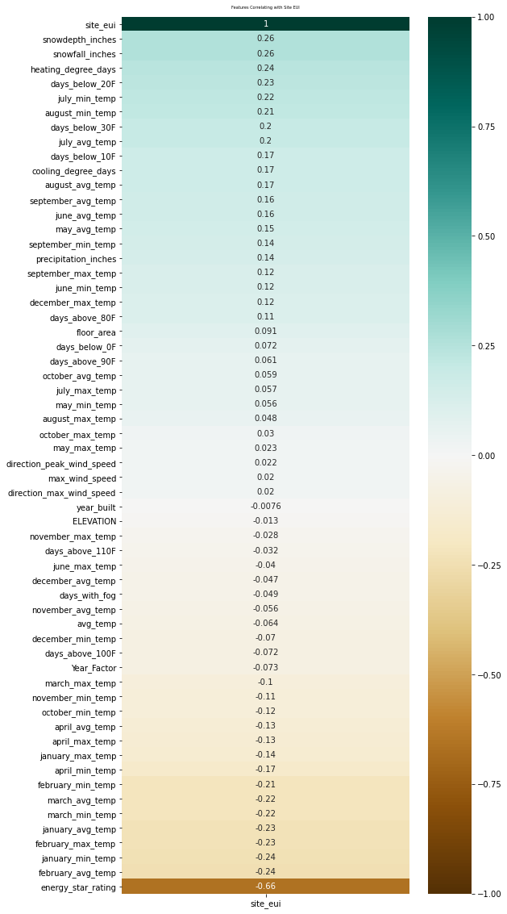

```

\newpage

### 11.2.1. Feature Transformations: Site EUI (no transform needed)

```{r, echo=FALSE ,out.width="75%", out.height="75%",fig.cap=" Site EUI (no transform needed)",fig.show='hold',fig.align='center'}


```

\newpage

### 11.2.2. Feature Transformations:  Floor Area Before and After
```{r, echo=FALSE ,out.width="70%", out.height="65%",fig.cap="Floor Area Before and After Transform",fig.show='hold',fig.align='center'}
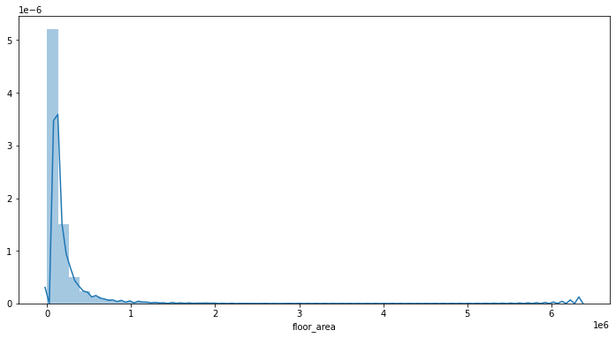


```

\newpage

### 11.2.3. Feature Transformations:  Year Built Before and After
```{r, echo=FALSE ,out.width="75%", out.height="75%",fig.cap="Year Built Before and After Transform",fig.show='hold',fig.align='center'}


```

\newpage

### 11.2.4. Feature Transformations:  Energy Star Rating Before and After
```{r, echo=FALSE ,out.width="75%", out.height="75%",fig.cap="Energy Star Rating Before and After Transform",fig.show='hold',fig.align='center'}


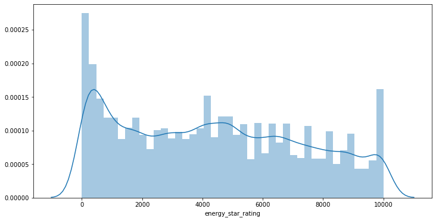

```
\newpage


### 11.2.5. Feature Transformations:  Elevation Before and After
```{r, echo=FALSE ,out.width="75%", out.height="75%",fig.cap="Elevation transform Before and After",fig.show='hold',fig.align='center'}


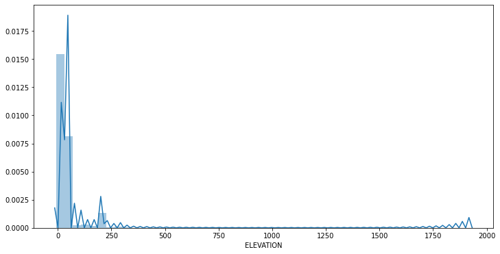

```
\newpage

### 11.2.6. FeatureTransformations:  FloorareaxElevation Before and After
```{r, echo=FALSE ,out.width="70%", out.height="70%",fig.cap="FloorareaxElevation Before and After Transform",fig.show='hold',fig.align='center'}


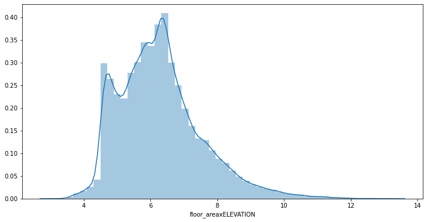

```
\newpage

### 11.2.7. Feature Transformations:  FloorxBuilt Before and After
```{r, echo=FALSE ,out.width="75%", out.height="75%",fig.cap="FloorxBuilt Before and After Transform",fig.show='hold',fig.align='center'}


```
\newpage


### 11.2.8. Feature Transformations:  FloorAreaxEnergy Before and After
```{r, echo=FALSE ,out.width="70%", out.height="70%",fig.cap="FloorAreaxEnergy Before and After Transform",fig.show='hold',fig.align='center'}


```

\newpage


### 11.2.9. Feature Transformations:  FloorxBuiltXEnergy Before and After

```{r, echo=FALSE ,out.width="75%", out.height="75%",fig.cap="Transforming Interaction of Floor area Year built and Energy star rating, Before and After",fig.show='hold',fig.align='center'}

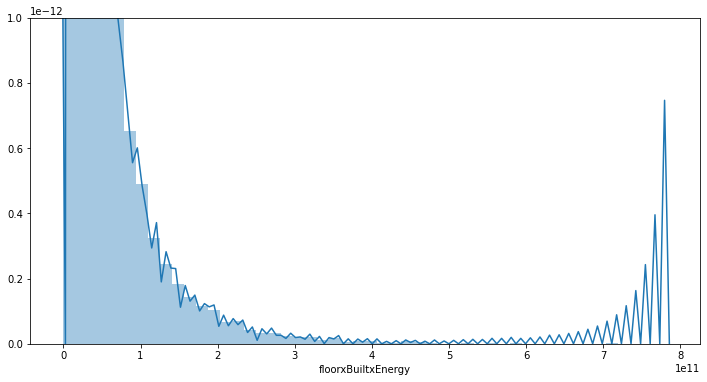

```

\newpage


### 11.2.10. Feature Transformations:  FloorxHeatCool Before and After
```{r, echo=FALSE ,out.width="75%", out.height="75%",fig.cap="VFloorxHeatCool Before and After Transform",fig.show='hold',fig.align='center'}

knitr::include_graphics('Main_Code/images/floorxHeatCool_before.png')
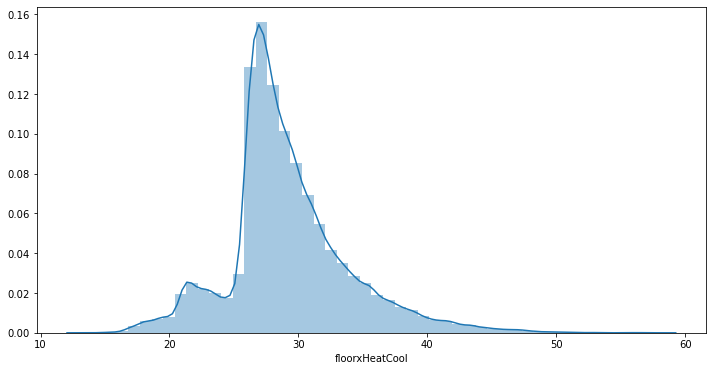
```

\newpage


### 11.2.11. Feature Transformations:  Freezing days Before (no transform needed)
```{r, echo=FALSE ,out.width="75%", out.height="75%",fig.cap="Freezingdays Before (no transform needed)t",fig.show='hold',fig.align='center'}


```

\newpage

### 11.2.12. Feature Transformations:  Cold days Before and After
```{r, echo=FALSE ,out.width="70%", out.height="70%",fig.cap="Colddays Before and After Transform",fig.show='hold',fig.align='center'}

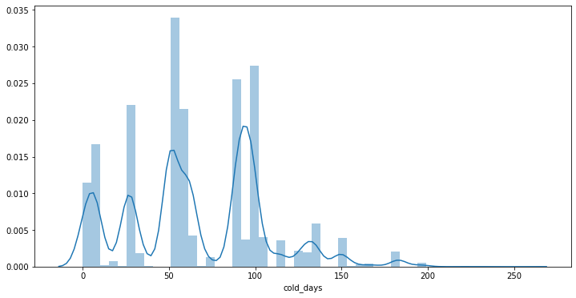
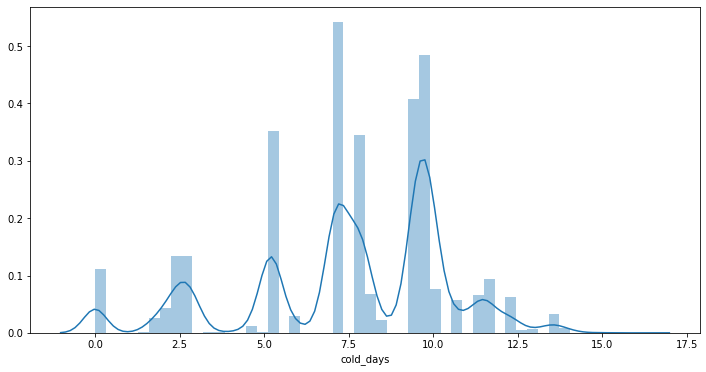

```

\newpage


### 11.2.13. Feature Transformations:  Warm days Before and After
```{r, echo=FALSE ,out.width="75%", out.height="75%",fig.cap="Warmdays Before and After Transform",fig.show='hold',fig.align='center'}


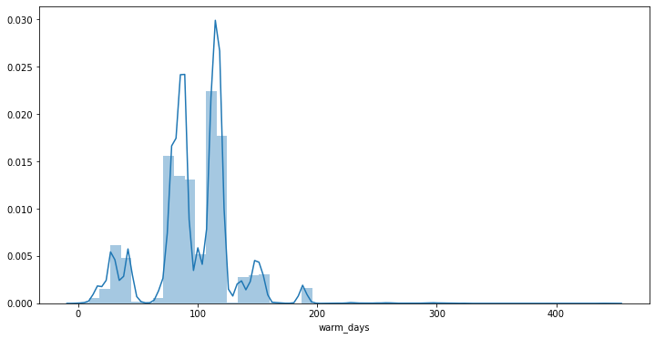

```

\newpage

### 11.2.14. Feature Transformations: Hot days Before (no transform needed)
```{r, echo=FALSE ,out.width="75%", out.height="75%",fig.cap="Hotdays Before (no transform needed)",fig.show='hold',fig.align='center'}
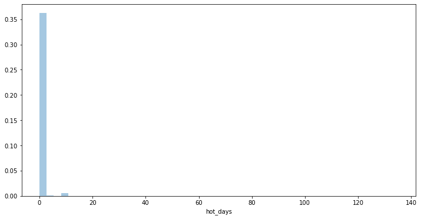

```
